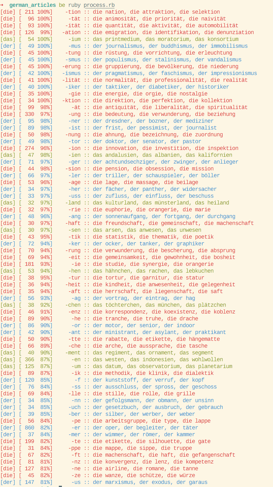

# German Articles

Simple script that analyzes the german noun endings and draws correlation with articles.
The data is from [Morphisto Lexicon](https://www1.ids-mannheim.de/lexik/TextGrid/morphisto.html)

## Usage

    bundle install
    bundle exec ruby process.rb

## Program output

